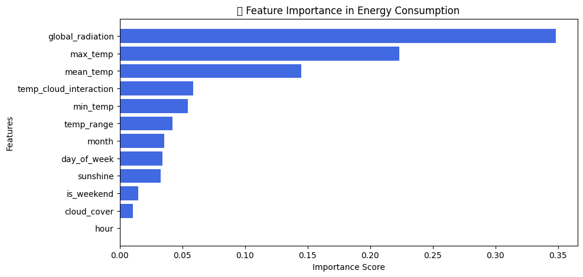
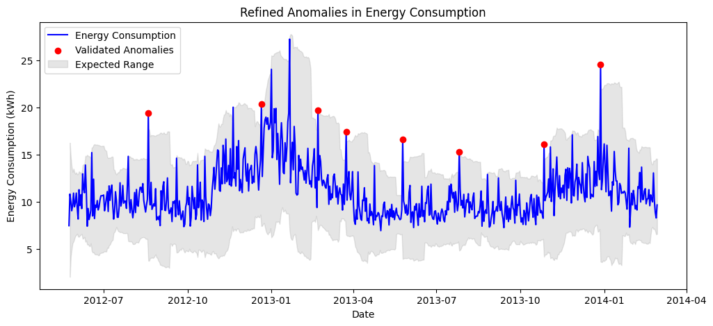

# EnergyGPT: AI-Driven Electricity Consumption Forecasting and Anomaly Detection

## Project Overview
EnergyGPT is an AI-powered system designed to forecast electricity consumption and detect anomalies using machine learning models. With increasing energy demands and the need for efficient power management, this project integrates historical energy consumption data with weather patterns to provide accurate predictions and insights.

### This project aims to:
- Improve energy consumption forecasting using AI-driven models.
- Detect anomalies that indicate power wastage, faulty equipment, or irregular consumption patterns.
- Optimize power distribution by predicting high-demand periods.
- Enhance grid stability and efficiency through data-driven insights.

## Key Features

### 1. Energy Consumption Forecasting
Accurate power demand forecasting is essential for energy providers to optimize resources, reduce costs, and ensure a stable power supply. Our AI models analyze historical consumption patterns, weather data, and seasonal trends to generate precise forecasts.

#### Related Notebooks:
- `modeling.ipynb` – Implements time series forecasting models, including Prophet.
- `weather_integration.ipynb` – Incorporates weather data into forecasting models.

### 2. Anomaly Detection in Power Consumption
Detecting anomalies in electricity usage can help identify inefficiencies, equipment failures, or unexpected spikes in consumption. The project utilizes machine learning techniques such as Isolation Forest and Autoencoders to detect unusual patterns.

#### Related Notebooks:
- `anomaly_detection.ipynb` – Implements anomaly detection models.
- `anomaly_detection_autoencoder.ipynb` – Uses deep learning for anomaly detection.

### 3. Integration of Weather Data for Enhanced Predictions
Weather conditions significantly impact electricity consumption. This project integrates external weather data, including temperature, precipitation, and radiation, to improve forecast accuracy.

#### Related Notebooks:
- `feature_engineering.ipynb` – Processes weather data and extracts relevant features.
- `weather_integration.ipynb` – Merges weather and energy consumption datasets.

### 4. Smart Grid Optimization and Decision Support
By leveraging AI-based forecasting and anomaly detection, EnergyGPT provides actionable insights to power grid operators and energy consumers. These insights help in:
- Preventing energy wastage.
- Reducing operational costs.
- Ensuring stable power distribution.

## Data Sources
The project primarily uses historical electricity consumption data and weather datasets. The processed datasets include:
- `hourly_energy_data.csv` – Hourly electricity consumption data.
- `cleaned_energy_data.csv` – Processed and cleaned energy data.
- `london_weather.csv` – Weather data (London Weather Dataset).
- `validated_anomalies.csv` – Validated anomaly data.

## Technologies Used
EnergyGPT is built using a combination of machine learning and deep learning techniques with the following technologies:

- **Programming Language:** Python  
- **Machine Learning Models:** Prophet, Isolation Forest, Autoencoders, Random Forest  
- **Data Processing & Analysis:** Pandas, NumPy, Scikit-learn  
- **Visualization:** Matplotlib, Seaborn, Plotly  
- **Forecasting:** Facebook Prophet  
- **Deployment (Future Work):** Streamlit for an interactive dashboard  

## Visuals

### Feature Importance in Energy Prediction
The following chart highlights the most influential features in our energy consumption forecasting model.


### Refined Anomalies in Energy Consumption
The following graph highlights detected anomalies within expected energy usage ranges.



## Project Structure
```bash
EnergyGPT/
│── data/                    # Contains raw and processed datasets
│   ├── processed/           # Cleaned and feature-engineered datasets
│   ├── raw/                 # Original datasets (not uploaded due to size)
│── notebooks/               # Jupyter notebooks for different ML tasks
│   ├── modeling.ipynb       # Time series forecasting models
│   ├── anomaly_detection.ipynb  # ML-based anomaly detection
│   ├── feature_engineering.ipynb  # Feature selection and transformation
│   ├── visualization.ipynb  # Data visualization and insights
│── outputs/                 # Generated analysis outputs
│── scripts/                 # Python scripts for automation
│   ├── dashboard.py         # Streamlit dashboard (for deployment)
│── LICENSE                  # Project license
│── .gitignore               # Ignored files (large datasets)
│── README.md                # Project documentation
```
## Contributions
Contributions are welcome! If you want to improve the model, add new features, or optimize code, feel free to submit a pull request.

For collaboration, reach out via **GitHub Issues** or email.

## License
This project is licensed under the **MIT License**. See [`LICENSE`](LICENSE) for details.
